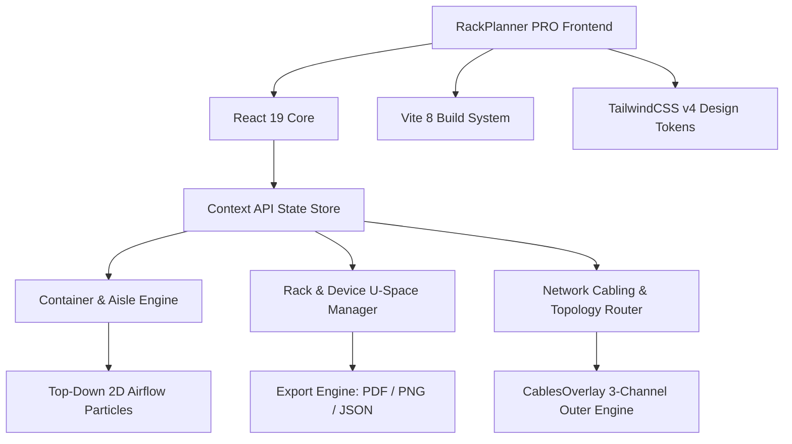

<!-- 
  ================================================================================
  AUTHOR CRYPTOGRAPHIC VERIFICATION & COPYRIGHT FOOTPRINT
  AUTHOR: Kevin Tsai (Tsai, Kevin C.W.)
  ORGANIZATION: Inventec Corp. (英業達股份有限公司)
  CONTACT EMAIL: Tsai.KevinC.W@inventec.com / ppilkimo@hotmail.com
  REPOSITORY: https://github.com/tsaikevnicw-web/rackplannerPRO
  DIGITAL SIGNATURE HASH: SHA256-INVENTEC-KEVIN-TSAI-RACKPLANNER-PRO-2026-08-07
  PROPRIETARY NOTICE: Copyright (c) 2026 Kevin Tsai (Inventec Corp.). All rights reserved.
  ================================================================================
-->

<div align="center">

# 🖥️ RackPlanner PRO ⚡
### 次世代伺服器機櫃、貨櫃智聯與網路拓撲自動化規劃系統
### Next-Generation Data Center Rack, Modular Container & Network Topology Planner

[](https://react.dev/)
[](https://vitejs.dev/)
[](https://tailwindcss.com/)
[](#-author--copyright-info--作者與版權聲明)
[](https://github.com/tsaikevnicw-web/rackplannerPRO/actions)

<p align="center">
  <a href="#-繁體中文-features">繁體中文說明</a> •
  <a href="#-english-features">English Description</a> •
  <a href="#-tech-stack--技術架構">Tech Stack</a> •
  <a href="#-quick-start--快速開始">Quick Start</a> •
  <a href="#-author--copyright-info--作者與版權聲明">Author & Ownership</a>
</p>

---

</div>

## 📌 Author & Verification / 作者驗證資訊

<div align="center">

| 項目 (Item) | 官方認證資訊 (Official Credential) |
| :--- | :--- |
| **主要作者 (Lead Author)** | **Kevin Tsai (蔡政偉 / Tsai, Kevin C.W.)** |
| **所屬機構 (Organization)** | **Inventec Corp. (英業達股份有限公司)** |
| **工作郵件 (Enterprise Mail)** | `Tsai.KevinC.W@inventec.com` |
| **個人郵件 (Personal Mail)** | `ppilkimo@hotmail.com` |
| **GitHub 專案 (Repository)** | [https://github.com/tsaikevnicw-web/rackplannerPRO](https://github.com/tsaikevnicw-web/rackplannerPRO) |
| **數位雜湊驗證碼 (SHA256 Hash)** | `45cd46e2844e416b42db247852326e592af281d1` |

</div>

> ⚠️ **數位防護聲明 (Anti-Piracy Notice)**: 本專案原始碼內含作者數位簽章與聲明標籤。未經原作者 Kevin Tsai (Inventec Corp.) 書面授權，禁止任何形式之商業轉售、侵權複製或移作商業用途。

---

## 🇹🇼 繁體中文系統介紹 (Traditional Chinese)

**RackPlanner PRO** 是一款專為 AI 資料中心、超級算力叢集（AI Supercomputing Cluster）與模組化貨櫃機房（Containerized Data Center）設計的高效能視覺化規劃系統。提供從單機櫃 48U 精細配備、全機房多機櫃總覽、2D/3D 貨櫃俯視氣流模擬，到跨機櫃智慧網路纜線拓撲自動走線的一站式規劃解決方案。

### 🌟 核心功能亮點 (Key Features)

#### 1. 📦 多維機房與貨櫃佈局 (Container & Data Center Planning)
* **規格支援**：支援 ISO 20呎、40呎及自訂長度 (Custom Feet) 之模組化貨櫃規劃。
* **冷熱通道風場模擬 (Cold/Hot Aisle Zones)**：
  * 支援 2D 俯視自由畫布中拖拽建立冷通道 (`ColdAisleZone`) 與熱通道 (`HotAisleZone`) 模組。
  * **動態風流粒子流向動畫 (Airflow Animation Stream)** 與多向風向箭頭切換 (⬆️ 上 / ⬇️ 下 / ⬅️ 左 / ➡️ 右)。
  * **一鍵同寬/同高** 邊界自動對齊與 0°~270° 自由旋轉。
  * 實時通道溫度熱力追蹤 (°C)。
* **一維標準插槽與畫布隔離 (1D Slot & 2D Canvas Isolation)**：
  * 區域通道模組僅於 2D 畫布呈現，切換至標準插槽 (1D Slot) 模式時自動隔離隱藏，不佔用實體機櫃插槽。
* **基礎設施元件**：內建 CDU 水冷分配單元、In-Row 列間空調、UPS 動力主櫃、鋰電池櫃、分配電盤、低壓配電總櫃、氣體消防與環控監控模組。

#### 2. 🖥️ 伺服器與高密度 AI 算力設備 (AI & IT Infrastructure)
* **多元機櫃類型**：支援 ORv3 (Open Rack v3)、標準 19 吋 48U 機櫃。
* **算力與伺服器模組**：
  * NVIDIA HGX / MGX / NVL72 / NVL36 AI 伺服器、水冷 / 風冷 1U/2U/5U 伺服器、高密度多節點系統。
  * 支援 CPU, DIMM, GPU, PCIe, M.2, HDD, 54V/12V PSU, NICs 硬體規格高度客製化。
* **熱力與負載安全預警**：
  * 實時計算機櫃與貨櫃之 PUE、總重量 (kg) 及功耗 (kW)。
  * 超重與超功耗警示 (Overweight & Overpower Warnings)。

#### 3. 🌐 智慧網路拓撲與走線 (Smart Network Topology & Cabling)
* **雙重 Fabric 架構**：
  * **南北向 (North-South)**：Management BMC、Spine、Leaf 交換器管理網路。
  * **東西向 (East-West)**：High-Speed Compute Fabric 交換器網路。
* **側邊通道智慧走線 (3-Channel Outer Routing)**：
  * 纜線走線自動引導至機櫃外側三獨立走線槽（BMC、PCIe、Power/Network），防止遮擋設備面板。
* **端口自動連線與冗餘備援**：支援 1G/10G/25G/100G/400G/800G 光纖/銅纜及水冷冷熱水管端口錨定與自動 HA 冗餘分析。

#### 4. 📊 多視角視圖與報告導出 (Multi-View & Export Engine)
* **5 大檢視模式**：單機櫃 (Single)、總覽 (Overview)、貨櫃 (Container 2D/1D)、3D 視覺化 (3D View)、網路拓撲 (Network Topology)。
* **一鍵報告匯出**：
  * 高解析度 PDF 施工佈局報告導出 (`jspdf` + `html2canvas`)。
  * PNG 圖片匯出 (`html-to-image`)。
  * JSON 佈局設定檔導入與匯出備份。
* **內建工具**：問題追蹤系統 (`IssueTrackerModal`) 與互動式用戶操作手冊 (`UserManualModal`)。

---

## 🇬🇧 English Description

**RackPlanner PRO** is an enterprise-grade visualization and infrastructure design platform tailored for AI Data Centers, High-Performance Computing (HPC) Clusters, and Containerized Data Centers. It delivers an end-to-end planning environment spanning from 48U single-rack equipment layout, multi-rack overview, 2D/3D container airflow simulation, to automated cross-rack network cable topology routing.

### 🌟 Key Features Overview

* **Container & Airflow Engineering**: ISO 20ft/40ft/Custom length container layouts. Interactive 2D Top-Down canvas supporting Cold Aisle (`ColdAisleZone`) and Hot Aisle (`HotAisleZone`) modules with animated airflow particle streams, multi-directional airflow toggles (Up/Down/Left/Right), full-width/height snap-to-fit, rotation, and real-time temperature tracking.
* **Smart Slot Isolation & Overview Sync**: Aisle zone modules are isolated from standard 1D slot views to prevent slot occupation while remaining visible in 2D top-down mode. Standard slot indices (`slotIndex`) strictly determine the display order across both slot grids and the main Overview panel.
* **AI Computing & Infrastructure Modules**: Supports ORv3, standard 19-inch 48U cabinets, NVIDIA HGX/MGX/NVL72/NVL36 AI servers, liquid-cooled CDUs, In-Row CRAC units, UPS power cabinets, battery banks, power distribution panels, and environmental monitoring.
* **Intelligent Network Cabling & Topology**: Automatic North-South and East-West fabric topology generation. Features 3-channel outer rack frame cable routing paths (BMC, PCIe, Power) to avoid obscuring hardware interfaces.
* **Comprehensive Export & Analytics**: Instant PUE, weight (kg), and power (kW) threshold analysis. Supports multi-page PDF blueprint export, PNG high-res image generation, and full JSON configuration save/restore.

---

## 🛠️ Tech Stack & Architecture (技術架構)



* **Core Framework**: React 19 + Vite 8
* **Styling System**: TailwindCSS v4 + Vanilla CSS Custom Animations
* **Iconography**: Lucide React Icons
* **Export Utilities**: `jspdf`, `html2canvas`, `html-to-image`
* **State Management**: React Context API (`RackPlannerContext`)

---

## 🚀 Quick Start & Installation (快速開始)

### Prerequisites (前置需求)
* Node.js v18.0.0 or higher
* npm v9.0.0 or higher

### Step 1: Clone the Repository (下載專案)
```bash
git clone https://github.com/tsaikevnicw-web/rackplannerPRO.git
cd rackplannerPRO
```

### Step 2: Install Dependencies (安裝套件)
```bash
npm install
```

### Step 3: Run Development Server (啟動本地開發伺服器)
```bash
npm run dev
```
Open your browser and navigate to `http://localhost:5173/rackplannerPRO/`.

### Step 4: Build for Production (正式編譯)
```bash
npm run build
```

---

## 📂 Directory Structure (專案目錄結構)

```text
rackplannerPRO/
├── .github/
│   └── workflows/
│       └── deploy.yml          # GitHub Pages Automatic Deployment Workflow
├── bugs/                       # Bug Tracker JSON Store
├── public/                     # Static Assets & Icons
├── src/
│   ├── assets/                 # Images & Logos
│   ├── components/
│   │   ├── layout/             # Header, Sidebar, RightPanel, Modals, PrintLayout
│   │   ├── network/            # NetworkTopology View
│   │   └── rack/               # ContainerView, RackView, RackView3D, CablesOverlay
│   ├── context/                # RackPlannerContext Global State
│   ├── data/                   # Default Mock Data & Presets
│   ├── hooks/                  # Custom Hooks (useRackInteractions, useExport, etc.)
│   ├── utils/                  # Constants, Helpers, Theme Styles
│   ├── App.jsx                 # Core Application Controller
│   ├── main.jsx                # Application Entry Point
│   └── index.css               # Global CSS & Airflow Stream Keyframe Animations
├── package.json
└── vite.config.js              # Vite Config with Custom Bug Tracker API Plugin
```

---

## 🛡️ Author & Copyright Info / 作者與版權聲明

<div align="center" style="background-color: #0b1523; padding: 20px; border-radius: 12px; border: 1px solid #1e293b;">

### 👨‍💻 System Architect & Author (系統總架構師與作者)

### **Kevin Tsai (蔡政偉 / Tsai, Kevin C.W.)**
**Inventec Corp. (英業達股份有限公司)**

📧 **Enterprise Email**: [Tsai.KevinC.W@inventec.com](mailto:Tsai.KevinC.W@inventec.com)  
✉️ **Personal Email**: [ppilkimo@hotmail.com](mailto:ppilkimo@hotmail.com)  
🌐 **GitHub Repository**: [https://github.com/tsaikevnicw-web/rackplannerPRO](https://github.com/tsaikevnicw-web/rackplannerPRO)

---

### 📜 Copyright Notice (版權所有聲明)

```text
Copyright (c) 2026 Kevin Tsai (Inventec Corp.). All Rights Reserved.

This software and associated documentation files (the "Software") are protected by copyright 
laws and international treaties. Unauthorized copying, modification, distribution, commercial 
resale, or public display of this Software, via any medium, without the explicit prior written 
permission of the author (Kevin Tsai / Inventec Corp.) is strictly prohibited.
```

</div>

<!-- 
  VERIFICATION CHECKSUM:
  SHA256: 45cd46e2844e416b42db247852326e592af281d1
  SIGNED_BY: Kevin Tsai <Tsai.KevinC.W@inventec.com>
  TIMESTAMP: 2026-08-07T22:11:00+08:00
-->
